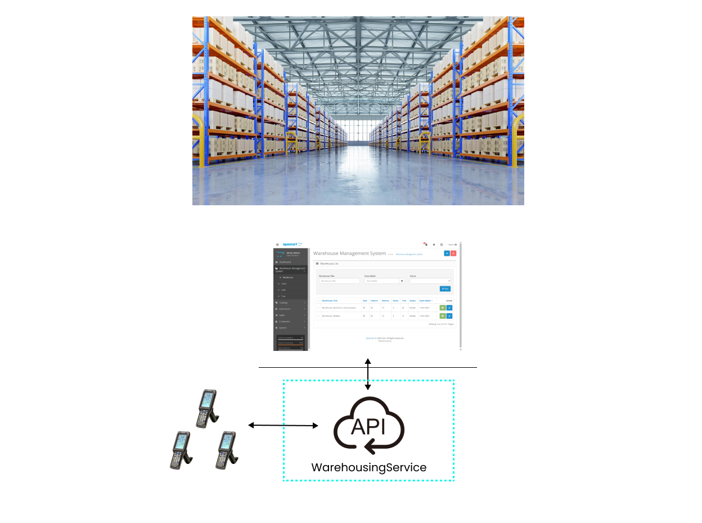

# Warehouse Management System

## Descritpion

A warehouse management system (WMS) is a tool that helps control and organize everything that goes on in the warehouse. It helps keep track of products and manage their storage. The system includes managing inventory, organizing the storage space, and coordinating the logistics of sending and receiving goods.




## Features - Product endpoint
- Creating products
- Retrieving products
- Searching for products
- Picking products


## Unpick specification
1. Add an unpick HTTP method `POST products/{id}/unpick`
2. Successfully unpick operation returns 204 No Content
3. When a product unpicked, the latest pick state is changed to Unpicked
4. When a product unpicked, the stock level increases correspondingly
5. Return BadRequest when stock level becomes bigger MaxStock Level (50)
6. BadRequest should have error "Cannot unpick more because reached max stock inventory limit"


## Run stryker
1. Go to test folder "MutationTestingMeetup.Tests"
2. Open PowerShell
3. Run
```dotnet stryker```

# Archive

## Event
-- agenda
-- mutation testing
--- talk about bread
-- demo MT
-- TDD
-- demo TDD

## DEMO MT
-Talk about Project
- Talk about ProductController and Product about the domain
- TODO: MAKE IMAGE?
- Check code coverage?
-Talk about Stryker
-- Show link https://stryker-mutator.io/
-- shot config file
-- let's run it


## Mutations
- "The product category must be specified" missiing - HasTextInBody
- ProductPicked edge case - add new test
- Again the exception message is not passed
- orderby in product finder -> add multiple products 2nd with Acer, then it is ordered
- ShouldNotReturnExistingProductWhenFilteredOut